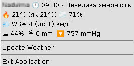

## Das Weather
### _Application to get Weather and show it (in system tray menu for now)_

     

### 📃 Features
- multiplatform
- quick and easy to use
- lightweight
- uses **Ukrainian** language to show weather info
- updated every 3 hours

### 📌 Using
- Register on [Weather API](https://www.weatherapi.com/) and get API-KEY
- Download last version of [Application distribution](https://github.com/anrydas/DasWeather/releases) archive and unpack it into any folder on your PC
- Rename **application.properties** file to **application-PROD.properties**.
- Into application-PROD.properties file:
  - Provide **app.api-key** parameter as API-KEY you have got before
  - Provide **app.weather.location** parameter
- Launch **start-prod.sh**

### 📜 Menu items

- Info Items:
  - 1st: **_Your Place Name_** 🕐 **_Last Updated_** - **_Condition_** 
  - 2nd: 🔥 **_Temperature_** ℃ (**_Fills Like_** ℃) 🌫 **_Humidity_ %** 
  - 3rd: 💨 **Wind Direction** **Wind Speed** (**Wind Gust**) km/h
  - 4th: ☁ **_Cloud_** % ☔ **Precipitation** mm 🔽 **_Pressure_** nnHg
- Clickable Items:
  - **Update Weather** - to update
  - **Exit Application** - to exit

### 🐞 Known issues
- In Linux (Mint?) OS the System Tray Icon doesn't appear - just black square
- To pretty view of Tray Icon Menu in Linux (Mint?) it needs to be launched with [JDK17](https://www.oracle.com/java/technologies/javase/jdk17-archive-downloads.html)

###### _Made by -=:dAs:=-_