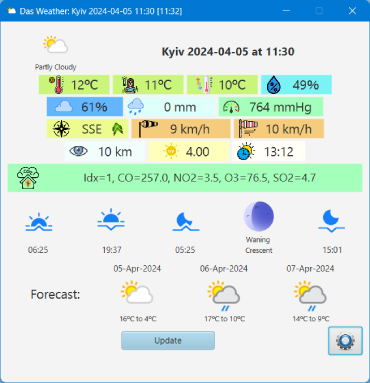
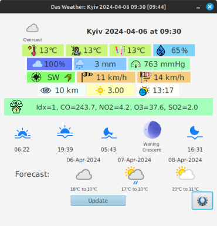
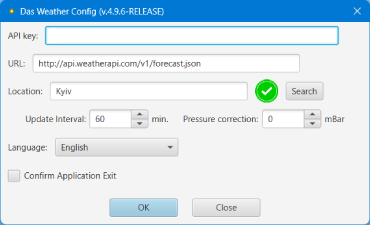
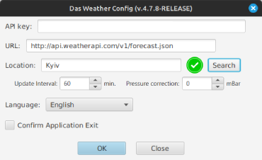
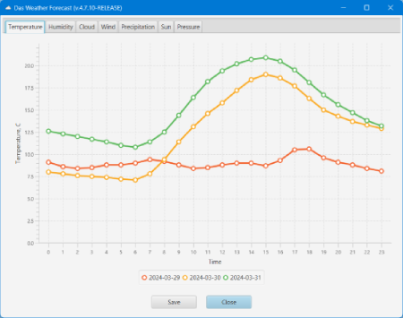
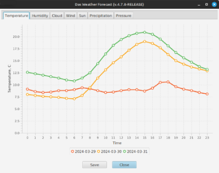
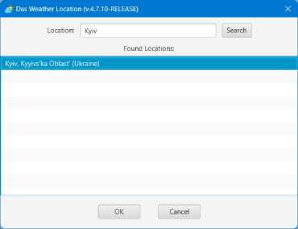

## Das Weather
### _Application to get Weather and show it_

   

### 📃 Features
- multiplatform
- quick and easy to use
- lightweight
- **multiple** languages (included 17 languages)
- configured update interval
- weather forecast

### 📌 Using
- Register on [Weather API](https://www.weatherapi.com/) and get API-KEY
- Download last version of [Application distribution](https://github.com/anrydas/DasWeather/releases) archive and unpack it into any folder on your PC
- Rename **application-default.properties** file to **application-PROD.properties** (if you want to launch application with **start-prod.sh** script).
- In **config/gui.config** file:
  - Provide **app.api-key** parameter as API-KEY you have got before
  - Provide **app.weather.location** parameter - name of city weather you want to get for.
- Launch **start-prod.sh** (use Java 8)
- Also, you may change settings with [Configuration window](#ConfigWin) after launching the application

### 📜 Main Window<a id='MainWin'/>
 
- Info Items:
  - 1st: **_Condition_** icon and it's name, **_Your Place Name_** and **_Last Updated_** - time when the weather have been updated  
  - 2nd: 🔥 **_Temperature_** ℃ **_Fills Like_** ℃ 🌫 **_Humidity_ %** 
  - 3rd: **Cloud** % **Precipitation** mm **Pressure** mmHg
  - 4th: 💨 **Wind Direction** (with arrow) **Wind Speed** km/h **Wind Gust** km/h
  - 5th: **Visibility** km **Ultra Violet Index** (with tooltip)
  - 6th: **Air Quality:**
  - 7th: **Sun Rise** **Sun Set** **Moon Rise** **Moon Phase** **Moon Set**
  - 8th: **Weather Forecast** - click on Image to show [Forecast Window](#ForecastWin) with forecast weather data
- Buttons:
  - **Update** - to update weather data
  - **Config** - to change Application's config

### 📜 Configuration Window<a id='ConfigWin'/>
 

### 📜 Forecast Window<a id='ForecastWin'/>
 
- Any forecast chart could be saved as PNG, JPEG, GIF or BMP file.
- 
### 📜 Location Window<a id='LocationWin'/>

- Gives possibility to find location to show weather/forecast in.

### 🐞 Known issues
- On Windows 11 after Hibernation the [Main window](#MainWin) may not be updated for couple minutes
  - **_Resolving:_** Press **Update** button. Anyway, it will be updated during 1 till 10 minutes.

###### _Made by -=:dAs:=-_